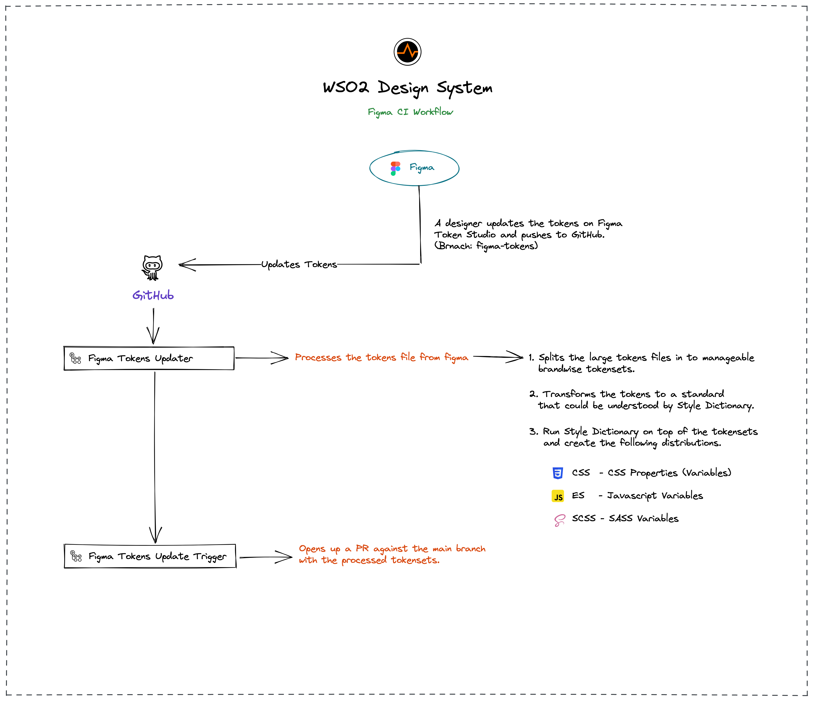

# Contributing to Oxygen

We would love for you to contribute to Oxygen and help make it even better than it is today!
As a contributor, here are the guidelines we would like you to follow:

 - [Setting Up Development Environment](#setting-up-development-environment)
 - [Commit Message Guidelines](#commit-message-guidelines)

## Setting Up Development Environment

Follow this guide to set up the source code, development tools & other software.

* [Mandatory Software & Tools](#mandatory-software-and-tools)
* [Setting up Development Tools](#setting-up-development-tools)
* [Setting up the Source Code](#setting-up-the-source-code)

### Mandatory Software & Tools

To build and write code, make sure you have the following set of tools in your local environment.


#### [Git](https://git-scm.com/downloads)

* Description 🗒️ : Open source distributed version control system.
* Download Link 🔗 : [https://git-scm.com/downloads](https://git-scm.com/downloads)

#### [NodeJS](https://nodejs.org/en/download/)

* Description 🗒️ : JavaScript runtime.
* Version: LTS (Latest Stable Version)

    > **Warning**
    > This project requires atleast NodeJS **v14.6.x** or above to work.
* Download Link 🔗 : [https://nodejs.org/en/download](https://nodejs.org/en/download)

#### [pnpm](https://pnpm.io)

* Description 🗒️ : Fast, disk space efficient package manager.
* Version: Latest (**v7.9.5** or higher)
* Download Link 🔗 : [https://pnpm.io/installation](https://pnpm.io/installation)

### Setting up Development Tools

These developer tools will help you to have a better developer experience since they'll help with debugging code, etc.

#### React Developer Tools

* Type 🧰 : Browser Extension
* Description 🗒️ : Browser DevTools extension for the open-source React JavaScript library. 
* Download Links 🔗
    * [Download for Chrome](https://chrome.google.com/webstore/detail/react-developer-tools/fmkadmapgofadopljbjfkapdkoienihi?hl=en)
    * [Download for Firefox](https://addons.mozilla.org/en-US/firefox/addon/react-devtools/)

#### ESLint

* Type 🧰 : IDE Extension
* Description 🗒️ : Static code analysis tool for JavaScript. 
* Download Links 🔗
    * [Download for Webstorm](https://www.jetbrains.com/help/webstorm/eslint.html)
    * [Download for VS Code](https://marketplace.visualstudio.com/items?itemName=dbaeumer.vscode-eslint)

#### Stylelint

* Type 🧰 : IDE Extension
* Description 🗒️ : Static code analysis tool for Stylesheets. 
* Download Links 🔗
    * [Setup for Webstorm](https://www.jetbrains.com/help/webstorm/using-stylelint-code-quality-tool.html)
    * [Download for VS Code](https://marketplace.visualstudio.com/items?itemName=stylelint.vscode-stylelint)

#### ShellCheck

* Type 🧰 : IDE Extension
* Description 🗒️ : A shell script static analysis tool. Used by our static analyzer PR check. 
* Download Links 🔗
    * [ShellCheck Core](https://github.com/koalaman/shellcheck#installing)
    * [Download for VS Code](https://github.com/vscode-shellcheck/vscode-shellcheck)

#### NX Console

* Type 🧰 : IDE Extension
* Description 🗒️ : Wrapper around NX commands so you don't have to memorize. 
* Download Links 🔗
    * [Download for VS Code](https://marketplace.visualstudio.com/items?itemName=nrwl.angular-console)
    * [Download for Web Storm](https://plugins.jetbrains.com/plugin/15000-nx-webstorm)

### Setting up the Source Code

#### Fork the repo

1. [Fork](https://docs.github.com/en/github/getting-started-with-github/fork-a-repo) the repository.
2. Clone your fork to the local machine.

Replace `<github username>` with your own username.

```shell
git clone https://github.com/<github username>/oxygen.git
```

3. Set the original repo as the upstream remote.

```shell
git remote add upstream https://github.com/wso2/oxygen.git
```

#### Install the dependencies

From the root of the project, execute the following command to install the project dependencies with `pnpm`.

```shell
pnpm install
```

#### Build the project

From the root of the project, execute the following command to build the project.

```shell
pnpm build
```

## Commit Message Guidelines

*This specification is inspired by and supersedes the [AngularJS commit message format][commit-message-format].*

We have very precise rules over how our Git commit messages must be formatted.
This format leads to **easier to read commit history**.

Each commit message consists of a **header**, a **body**, and a **footer**.

```
<header>
<BLANK LINE>
<body>
<BLANK LINE>
<footer>
```

The `header` is mandatory and must conform to the [Commit Message Header](#commit-header) format.

The `body` is mandatory for all commits except for those of type "docs".
When the body is present it must be at least 20 characters long and must conform to the [Commit Message Body](#commit-body) format.

The `footer` is optional. The [Commit Message Footer](#commit-footer) format describes what the footer is used for and the structure it must have.


#### <a name="commit-header"></a>Commit Message Header

```
<type>(<scope>): <short summary>
  │       │             │
  │       │             └─⫸ Summary in present tense. Not capitalized. No period at the end.
  │       │
  │       └─⫸ Commit Scope: primitives|scss|react
  │
  └─⫸ Commit Type: build|ci|docs|feat|fix|perf|refactor|test
```

The `<type>` and `<summary>` fields are mandatory, the `(<scope>)` field is optional.


##### Type

Must be one of the following:

* **build**: Changes that affect the build system or external dependencies (example scopes: gulp, broccoli, npm)
* **ci**: Changes to our CI configuration files and scripts (examples: CircleCi, SauceLabs)
* **docs**: Documentation only changes
* **feat**: A new feature
* **fix**: A bug fix
* **perf**: A code change that improves performance
* **refactor**: A code change that neither fixes a bug nor adds a feature
* **test**: Adding missing tests or correcting existing tests


##### Scope
The scope should be the name of the npm package affected (as perceived by the person reading the changelog generated from commit messages).

The following is the list of supported scopes:

* `examples` - Changes to any of the `examples`.
* `primitives` - Changes to the `@oxygen-ui/primitives` package.
* `react` - Changes to the `@oxygen-ui/react` package.
* `logger` - Changes to the `@oxygen-ui/logger` package.

There are currently a few exceptions to the "use package name" rule:

* `packaging`: used for changes that change the npm package layout in all of our packages, e.g. public path changes, package.json changes done to all packages, d.ts file/format changes, changes to bundles, etc.

* `changelog`: used for updating the release notes in CHANGELOG.md

* `dev-infra`: used for dev-infra related changes within the directories like /scripts.

* `docs-infra`: used for docs page changes. (`<ROOT>/docs`)

* none/empty string: useful for `test` and `refactor` changes that are done across all packages (e.g. `test: add missing unit tests`) and for docs changes that are not related to a specific package (e.g. `docs: fix typo in example`).


##### Summary

Use the summary field to provide a succinct description of the change:

* use the imperative, present tense: "change" not "changed" nor "changes"
* don't capitalize the first letter
* no dot (.) at the end


#### <a name="commit-body"></a>Commit Message Body

Just as in the summary, use the imperative, present tense: "fix" not "fixed" nor "fixes".

Explain the motivation for the change in the commit message body. This commit message should explain _why_ you are making the change.
You can include a comparison of the previous behavior with the new behavior in order to illustrate the impact of the change.


#### <a name="commit-footer"></a>Commit Message Footer

The footer can contain information about breaking changes and deprecations and is also the place to reference GitHub issues, Jira tickets, and other PRs that this commit closes or is related to.
For example:

```
BREAKING CHANGE: <breaking change summary>
<BLANK LINE>
<breaking change description + migration instructions>
<BLANK LINE>
<BLANK LINE>
Fixes #<issue number>
```

or

```
DEPRECATED: <what is deprecated>
<BLANK LINE>
<deprecation description + recommended update path>
<BLANK LINE>
<BLANK LINE>
Closes #<pr number>
```

Breaking Change section should start with the phrase "BREAKING CHANGE: " followed by a summary of the breaking change, a blank line, and a detailed description of the breaking change that also includes migration instructions.

Similarly, a Deprecation section should start with "DEPRECATED: " followed by a short description of what is deprecated, a blank line, and a detailed description of the deprecation that also mentions the recommended update path.


### Revert commits

If the commit reverts a previous commit, it should begin with `revert: `, followed by the header of the reverted commit.

The content of the commit message body should contain:

- information about the SHA of the commit being reverted in the following format: `This reverts commit <SHA>`,
- a clear description of the reason for reverting the commit message.

## Designing

Designers working on the Oxygen UI Design System should use Figma as the source of truth for design assets and utilize Figma Tokens for creating design components. [Figma Tokens](https://tokens.studio/) is a tool that allows designers to create a set of standardized design variables (e.g., colors, typography, spacing) that can be reused across various design projects.

To contribute design changes to Oxygen UI, designers should follow these steps:

1. Create or modify design components using Figma and ensure that they utilize Figma Tokens.
2. Use the Figma Tokens plugin to push the tokens directly from Figma to the Oxygen UI repository.
3. Commit and push the token changes to GitHub, using the following commit message:

  ```bash
  chore(figma): sync figma tokens with github
  ```

  Above will commit directly to the [`figma-tokens`](https://github.com/wso2/oxygen-ui/tree/figma-tokens) branch.

4. A GitHub workflows will automatically be triggered to process the committed design tokens and convert them to a [style dictionary](https://github.com/amzn/style-dictionary) compatible design-token variation.

5. Once the workflow finishes, a PR will be created against the `main` branch with the following format.

  ```bash
  # PR Title
  chore(primitives): update figma tokens

  # PR Lables
  `automated pr`, `package:primitives`
  ```
6. Review the PR and merge it to the `main` branch.

By following these steps, designers can ensure that their design changes are properly integrated into Oxygen UI and available for use by other contributors.

Following diagram illustrates the design tokens workflow.



## Versioning

For details on the project's versioning policy, please refer to the [VERSIONING_POLICY.md](VERSIONING_POLICY.md) document. It is recommended to read this document before carrying out any versioning-related tasks.
